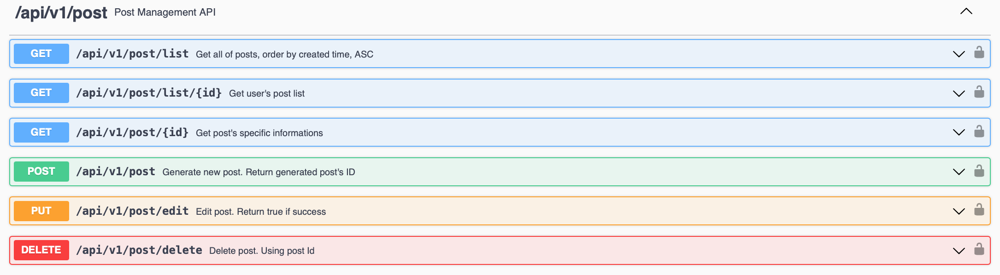

RESTful API for Board Service
===
***
Simple RESTful API for Board Management with functions below
- User Management
- User Authorization
- Post Management
- Comment Management
- Hashtag by post
- Search by Hashtag,User,Title
- Access control according to member level
***
## Contents

1. [Development Tools](#development-tools)
2. [Skills](#skills)
3. [Check before using API](#check-before-using-api)
4. [How to use API?](#how-to-use-api)
5. [ERD](#erd)
6. [API Architecture](#architecture)
7. [Used modules](#used-node-modules)
8. [API Endpoints](#endpoints)
9. [API Document](#api-documentation)
10. [TODOs](#todos)
***
## Development Tools
- IDE
    - Jetbrain Webstorm
    - Visual Studio Code
- API Testing
    - Postman
- OpenAPI Documentation
    - Swagger
- Database
    - TablePlus
    - MongoDB Compass
- Others
    - Docker

## Skills
- Language : Node.js, Shell script
- Framework : Express.js
- ORM : Sequelize
- Database : MySQL 8.0, MongoDB
- Application Environment : Redis, Docker, Docker-Compose
- Authorization : JWT Token

## Check before using API
### Least Required
- [Docker](https://www.docker.com) installed in your PC
- Linux or Mac OS as Host Machine
- Not normally supported on Windows(Docker Compose Issue)
### Environment Spec
- Network : Use docker bridge network, docker DNS
- Volume : Use docker volume

## How to use API?

### Without using Docker-Compose
- This script will build same environment as described in `docker-compose.yaml`
- Script exist in [`/pure-docker-env` directory](./pure-docker-env)
- Initiate API Environment
    ~~~
    cd pure-docker-env

    bash init.sh
    ~~~
    Connect to swagger document : `localhost:4000/api-docs` 
- Clear Environment
    ~~~
    cd pure-docker-env
    
    bash clear.sh
    ~~~
### With Docker-Compose
- Initiate API Environment
    ~~~
    docker compose up -d
    ~~~
    - Please wait a moment until API container connect to database completely
    - Connect to swagger document : `localhost:4000/api-docs` 
- Clear Environment
    ~~~
    docker compose down
    ~~~
## ERD

## Architecture

## Used node modules
|Package Name|Description|
|:---:|:---:|
|bcrypt|For password encrption|
|cors|Prevent CORS problem|
|dotenv|Convert to Environment Variable described in `.env`|
|express|Express Framework|
|jsonwebtoken|For JWT Token authorization|
|morgan|Logger|
|ms|Convert string type time format to numeric type time|
|mysql2|Sequelize dependency|
|redis|Redis connection for caching|
|sequelize|sequelize module|
|sequelize-cli|Utilities related to sequelize for CLI environment|
|swagger-jsdoc|Swagger dependency|
|swagger-ui-express|Swagger UI Middleware|
|uuid|For uuid generation|
|yamljs|Swagger doc, yaml dependency|
|mongoose|MongoDB Connection|

## Endpoints

### Basic API : /

### Auth API : /api/v1/auth

### User API : /api/v1/user

### Post API : /api/v1/post

### Comment API : /api/v1/comment

## API Documentation

### Swagger

- Swagger API was written in [`/docs` directory](./docs/) with .yaml type
- Connect to swagger : `localhost:4000/api-docs`

### Application global environment variable

- Directory : /config/.env
- **Do not change `PORT` field**
- Each field represent these
    - PORT : Service port
    - MODE : If you want to make API as `production mode` change into `production`. If you want to set as `development mode` change into `development`
    - JWT_SECRET : JWT secret
    - JWT_EXPIRE : Authorization token expire time
    - JWT_REFRESH_EXPIRE : Refresh token expire time
    - ISSUER : JWT issuer
    - DEFAULT_LIMIT,DEFAULT_OFFSET : offset, limit value for pagination
    - ENCRYPT_COUNT : encrpytment counter for bcrypt

### Database, Redis, MongoDB connection configuration

**Mongo DB configuration will be update soon**

- Directory : /config
- Database connection management : config.json
    - Do not change  `host` if you use API with embedded docker, docker-compose in this project
- Redis connection management : redisconfig.json
    - Basically this project use redis without password. If you want to set password or use redis replication, you need to change redis connection code located in `middlewares/jwtauth.js`
- MongoDB connection management : mongoconfig.json

## TODOs

- [ ] Merge Mongo DB applied version

- [ ] Set Proxy : Nginx

- [ ] Search API

- [ ] Optimization, Refactoring

- [ ] Service re-implement to Spring Boot

- [ ] Seperate swagger by router

- [ ] Apply PM2 for multi-thread operation

- [ ] Change logger to Winston

- [ ] Database Migration : Maria DB

- [ ] Test Code with Jest